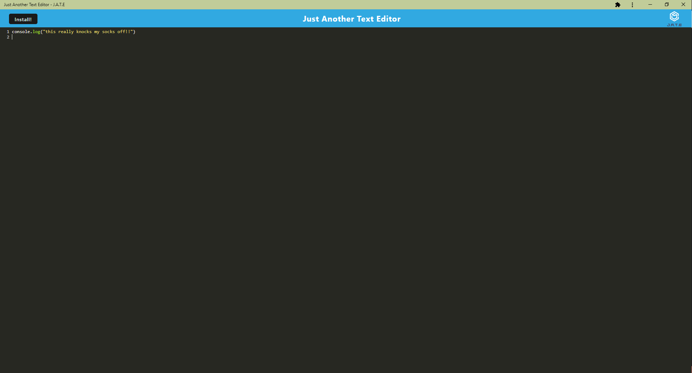

 # PWA Text Editor
    
 ## Description
 This text editor is a PWA that allows you to create and save notes. It uses a server to store the notes, so you can access them from anywhere. It also uses a service worker to cache the site, so you can access it offline.       
        
 ## Table of Contents
 * [Installation](#installation)
 * [Usage](#usage)
 * [License](#license)
 * [Contributing](#contributing)
 * [Tests](#tests)
 * [Questions](#questions)
                
 ## Installation
 [This will take you to the deployed site](https://text-editor-of-the-future-44733cac4a32.herokuapp.com/).

 If one wishes to install this locally, one can clone the repo and run `npm install` to install the dependencies. Then run `npm start` to start the server.           
        
 ## Usage
 This text editor can be used to create and save notes. It can be accessed from anywhere, and it can be used offline. In order to use it offline, you must first visit the site while online. Then you can access it offline. The site will be cached, so you can access it offline. When you go back online, the site will update to the latest version.       
        
 ## License
 MIT
        
 ## Contributing
 University of Utah
 edX
 Jonathan Bejarano          
        
 ## Tests
 No tests are included in this project.        
 ## Questions
 If you have any questions, please contact me at michaelgregoryayers@email.com or visit my GitHub page at
        https://github.com/michaelayers3.
    
